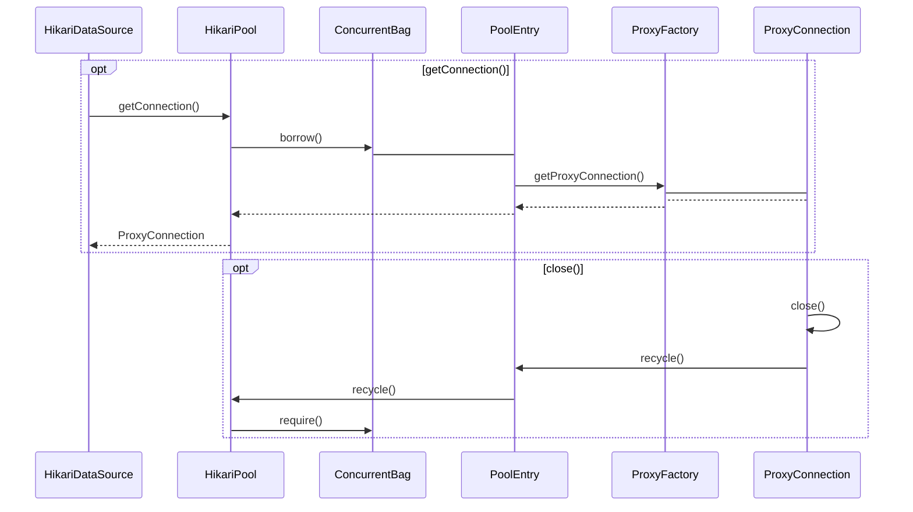

## 核心组件

1. HikariDataSource，入口管理程序，负责getConnection()
2. HikariPool，连接资源池管理模块，负责资源池整体状态的管理
3. ConcurrentBag，资源池存储模块，负责资源的增加、删除、借用、归还
4. PoolEntry，资源池对象，对ProxyConnection的封装，记录状态、时间等
5. ProxyFactory，代理数据库连接工厂，负责管理数据库连接代理
6. ProxyConnection，代理数据库连接对象，对原始Connection的封装，并代理close()

## 生命周期

- getConnection()，获取数据库连接
- close()，关闭数据库连接
